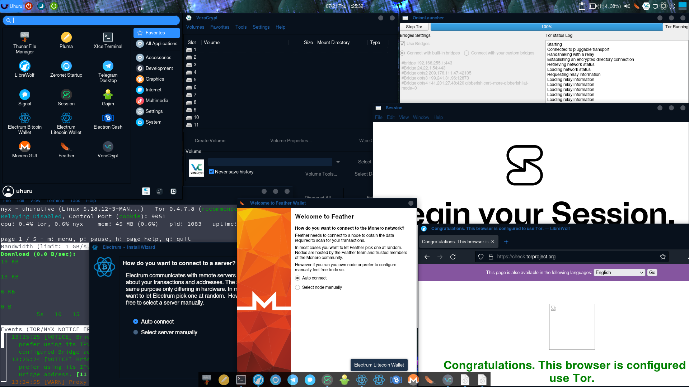
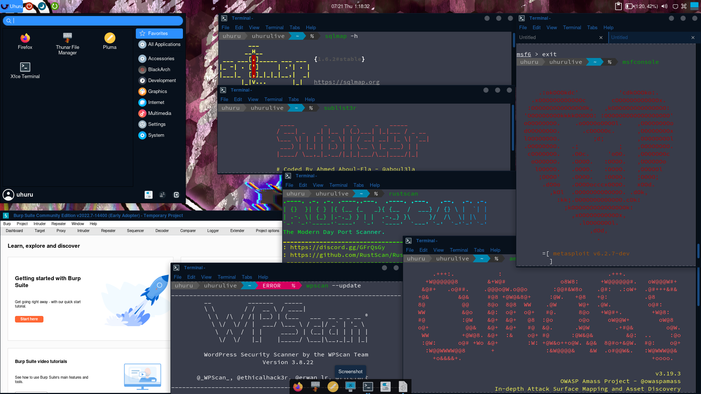
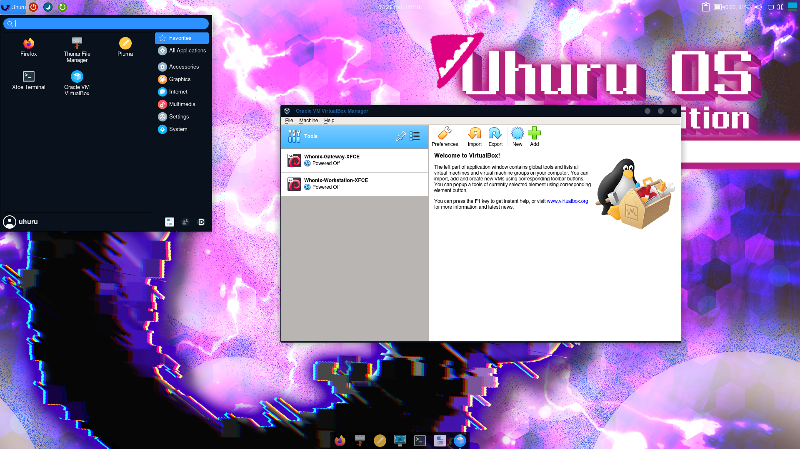

<p align="center">
    
</p>
<h1 align="center">Uhuru OS</h1>
<p align="center">
  <a> A Distro focused on enhancement several types of security <br> </a>
  <br>
  
  
  
  
  
  

</p>

Overview
--------

UhuruOS is a Distro focused on enhancement several types of security based on Arch Linux.  
  
  
Uhuru is forked from Alter Linux to make use of Alter's existing resources such as coloring and configurations.  
Please visit [this page](https://github.com/FascodeNet/alterlinux).  
The credit goes to Fascode Network, maintainers of Alter.  

Features
--------

*   Manjaro Repos (for stable updates)
*   Beautiful-Looking (from [Alter Linux](https://github.com/FascodeNet/alterlinux))
*   Pre-installed [BlackArch](https://blackarch.org/tools.html) Repos
*   Graceful theme [(MidNight-BlueNight Theme)](https://github.com/i-mint/midnight)
*   Live boot (No need to install, leaves no digital footprint)


Download
--------

Uhuru is built everyday and auto-uploaded to anonfiles.  
Please download a prebuilt iso image from [releases page](https://github.com/infoengine1337/uhuruos/releases).  

Edditions
---------

### Loid Edition - the Edition aimed at preserving Privacy and Anonymity
  
  
  
Some utilities are based on [Obscurix Linux](https://github.com/Obscurix/Obscurix)  

#### Pre-Installed packages

*   Tor - a anonymizing network
*   Nyx - a command-line monitor for Tor
*   LibreWolf - a Privacy-focuced Browser forked from Firefox
*   Zeronet - a decentralized peer-2-peer network
*   ProxyChains - a utility for connecting with proxy
*   Thunderbird - standard email client
*   Gajim - standard XMPP client
*   Messangers (Telegram, Signal, Session)
*   Crypto Wallet (Electrum(Bitcoin), Electrum-ltc(Litecoin), ElectronCash(Bitcoin-cash), Monero-GUI, feather-wallet(monero))
*   VeraCrypt - storage encrypting utility
*   And more...

### Yor Edition - the Edition aimed at Pentesting and Offensive Security
  
  
  

#### Pre-Installed packages

*   Port Scanner (nmap, Rustscan, masscan, ...)
*   Subdomain reconing (sublist3r, dnsrecon, subfinder, dnsvalidator, ...)
*   Passive reconing (theHarverster, spiderfoot, amass, subjack, ...)
*   Dorking (udork, gitdorker, gitrob, trufflehog, ...)
*   Directory Enum (gobuster, dirb, ...)
*   Fuzzing (ffuf, feroxbuster, ...)
*   Crawler (hakrawler, dirhunt, kiterunner, gospider, ...)
*   Scanner (whatweb, nikto, OWASP ZAP, burpsuite, nuclei, ...)
*   Exploit (metasploit, sqlmap, astra, ...)
*   CMS Pentest (vulnx, wpscan, droopescan, magescan, ...)
*   Useful Utilities (seclist wordlist, sploitctl, mitmproxy, chisel, sshuttle, veli, ...)
*   And more...

### Anya Edition - the Edition aimed at launching VM

[Whonix-Gateway and Whonix-Workstation](https://www.whonix.org/wiki/VirtualBox) are included by defaults  
  
  
  

#### Pre-Installed packages

*   VirtualBox
*   Docker
*   lxd

Added Utilities
---------------

### "uhurukey-ja" and "uhurukey-en" commands

This commands enable us to switch the keyboard layout and input methods.  
If you want to switch from Japanese to English, please enter this:  
```
uhurukey-en
```

If you want to switch from English to Japanese, please enter this:  
```
uhurukey-ja
```

IMPORTANT
---------

Calamares installer is not maintained and the use is not recommended.  
If you use this installer, you could compromise safety.  


DISCLAIMER
-------

This program is for edicational purpose only.  
DO NOT use this program for any illegal activity.  
We are not liable to you for any damages as a result of using our program.  


WELCOME TO MATRIX SERVER!!
--------------------------

If you are interested in Uhuru's development, you can join our Matrix [Server](https://matrix.to/#/#uhuruos:privex.io)!
