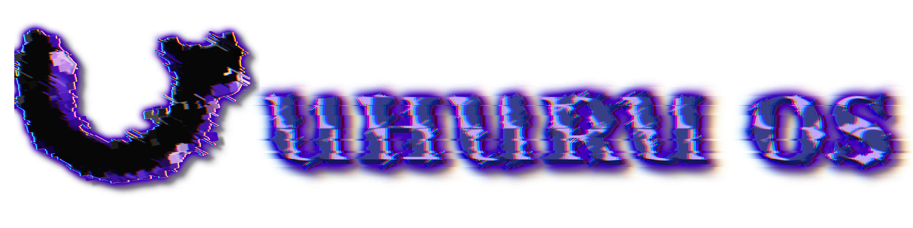
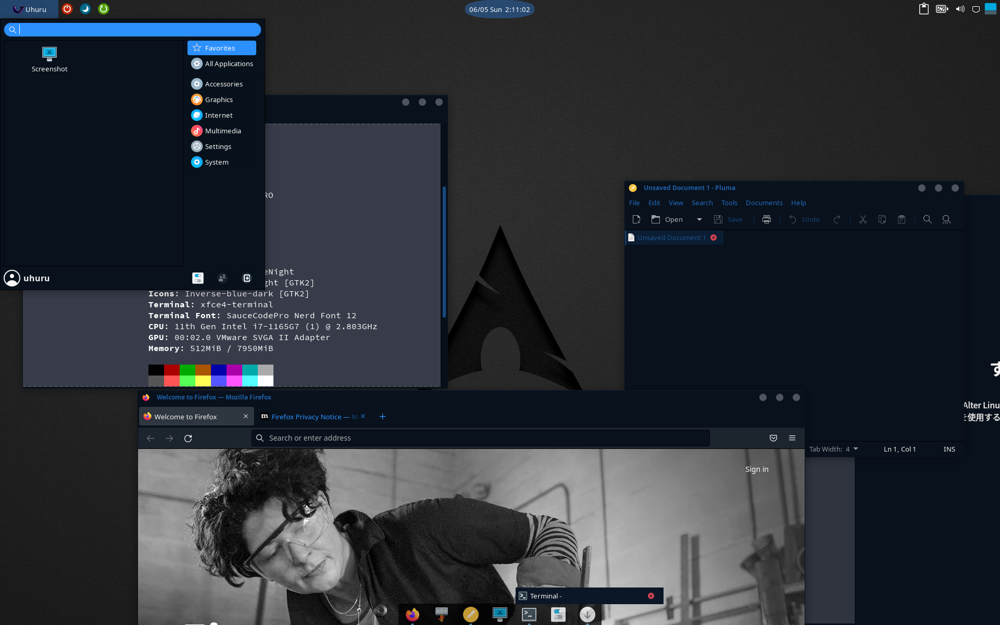
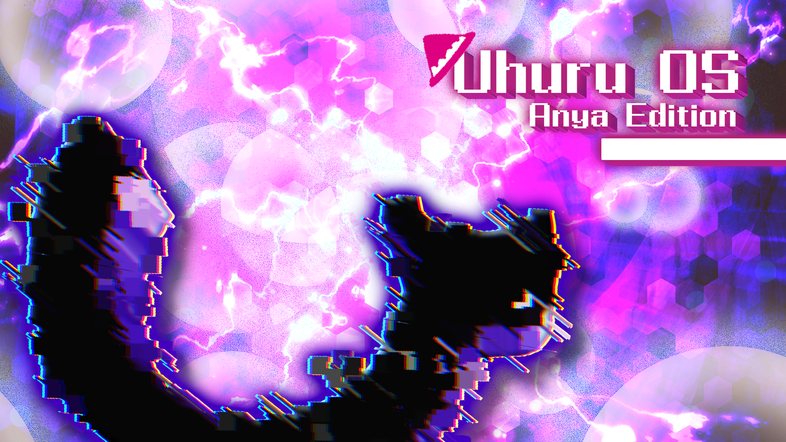

<h2>Uhuru OS - a Hackers' Linux Distribution based on Arch Linux</h2>

    

<h2> Overview </h2>
UhuruOS is a Hackers' Linux Distribution based on Arch Linux and so on.  

 

 

This cool terminal configration is based on Alter Linux. 
Check this <a href="https://github.com/orgs/FascodeNet/projects/2">page</a>.  Thanks to FascodeNetwok and developers.

<h2> Features </h2>
<ul>
    <li>Manjaro Repository for stable update</li>
    <li>Sophisticated appearance (Thanks to Alter Linux)</li>
    <li>Pre-installed BlackArch Repository </li>
    <li>Beautiful Theme (MidNight-BlueNight) </li>
</ul>

<h2> Edditions </h2>
<h3> Loid Edition </h3>
This edition is for users who wants to protect their privcacy. 
---This edition is under construction--- 
 

<h4> Pre-Installed packages</h4>
<ul>
    <li>Tor</li>
    <li>TorBrowser-Launcher</li>
    <li>ProxyChains</li>
    <li>Telegram</li>
    <li>Signal</li>
    <li>Session</li>
    <li>Thunderbird (EMail client)</li>
    <li>Gajim (XMPP client)</li>
    <li>Electrum</li>
    <li>Electrum-ltc</li>
    <li>ElectronCash</li>
    <li>Monero-GUI</li>
    <li>monero-feather</li>
    <li>VeraCrypt</li>
    <li>RiseupVPN</li>
    <li>And...So on!</li>
</ul>

<h3> Yor Edition </h3>
This edition is for pentester. 
---This edition is under construction--- 
 

<h4> Pre-Installed packages</h4>
<ul>
    <li>nmap</li>
    <li>Rustscan</li>
    <li>masscan</li>
    <li>sublist3r</li>
    <li>dnsrecon</li>
    <li>ffuf</li>
    <li>seclists</li>
    <li>mitmproxy</li>
    <li>nikto</li>
    <li>metasploit</li>
    <li>sploitctl(searchsploit and etc)</li>
    <li>sqlmap</li>
    <li>wpscan</li>
    <li>droopescan</li>
    <li>magescan</li>
    <li>wireshark-qt</li>
    <li>wireshark-cli</li>
    <li>tcpdump</li>
    <li>hydra</li>
    <li>john</li>
    <li>...And so on!</li>
</ul>

<h3> Anya Edition </h3>
This edition purpose is launch Virtual Machine & container easily. 
---This edition is under construction--- 
 

<h4> Pre-Installed packages</h4>
<ul>
    <li>VirtualBox</li>
    <li>Docker</li>
    <li>lxd</li>
</ul>

